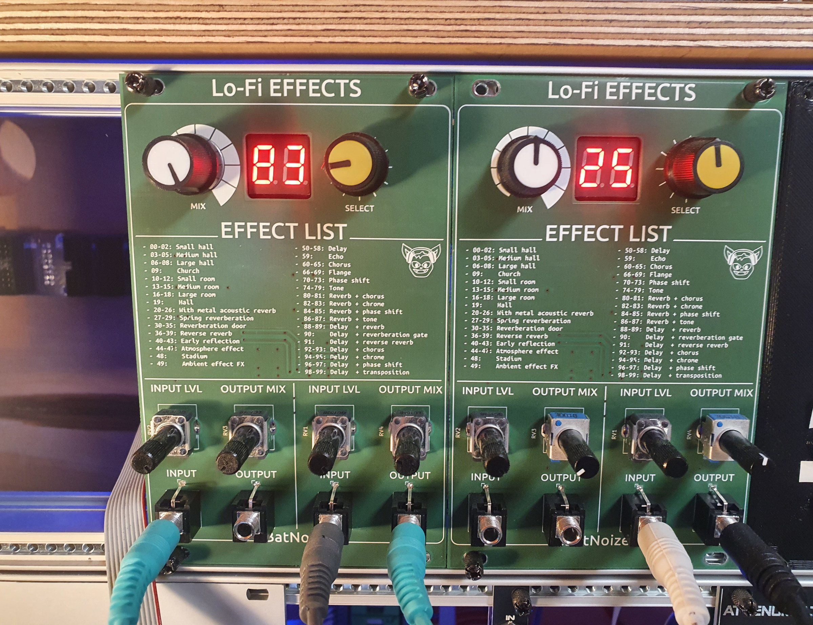
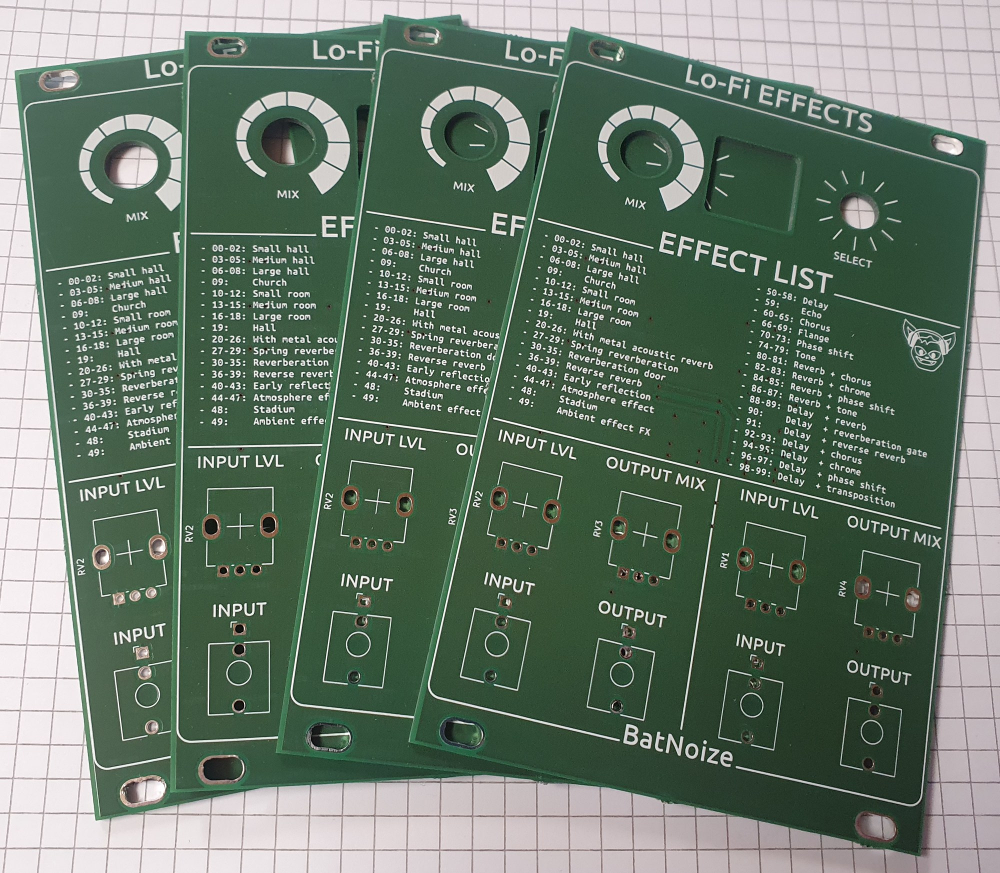
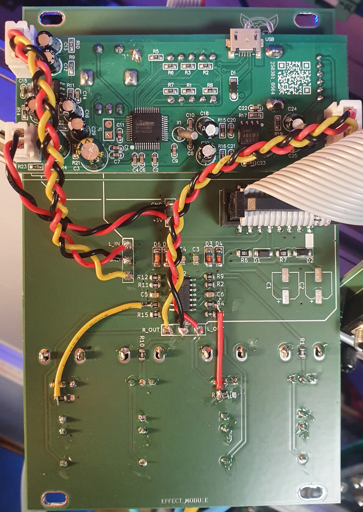

# LoFi Effects
This Project is based on a cheap DSP Multi Effect module.
- For the usage you find example at HAGIWOs Video 
  - https://youtu.be/Vsx6v7v1p2I
  - Please support his work.

- I've choosen a very low cost design.
  - Only one PCB with some SMD components 

## Discount & Support European PCB Manufacturing

If you'd like to support this project and a European PCB manufacturer, use code **MakeInEurope-ZFYQY** at checkout for **€10** off your first **Aisler** order.

To buy this PCB you can either download the gerber files and by where you want or use this link to by at [aisler.net/p/XYSKKRYT](aisler.net/p/XYSKKRYT)

## Images

* this is the first version. But the current gerber files are fixed already.

## Schematic

## BOM

[BOM](BOM/ibom.html)

## Disclaimer

This PCB layout is provided "as is," without warranty of any kind. By using these files, you acknowledge and agree to the following:

- No Liability: I am not responsible for the functionality, performance, or your satisfaction with the final build. Use this design at your own risk.

- Components: I am not responsible for the quality, compatibility, or availability of the electronic components used in connection with this project.

- Manufacturing: I am not liable for the quality of the PCB fabrication or any errors introduced during the manufacturing process by third-party services.

- Safety: You are solely responsible for ensuring that the assembled device is safe to use. I assume no responsibility for any damages, injuries, or losses resulting from the use of this layout.
